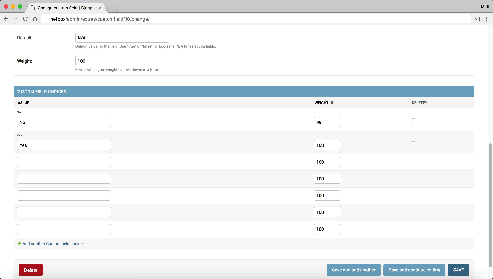

Netbox Integration
==================

Configuring NetConfig
---------------------

Netconfig supports two methods of tracking network device inventory:

1. Local database using SQLAlchemy
2. API call through Netbox, an open source DCIM solution found here: https://github.com/digitalocean/netbox

By default, NetConfig is set to use a local SQLAlchemy database

Configure Netconfig for Netbox API Access
^^^^^^^^^^^^^^^^^^^^^^^^^^^^^^^^^^^^^^^^^

In the root Netconfig directory, open file 'instance/settings.py' (this should be /home/netconfig/netconfig/instance/settings.py)

Navigate to the line that reads:
    
    DATALOCATION = 'local'

Change it to read:

    DATALOCATION = 'netbox'

Navigate to the line that reads:

    NETBOXSERVER = ''

Set the URL for your Netbox server using single quotes.  Example:

    NETBOXSERVER = 'http://netbox.domain.com'

Save and close the file

Configuring Netbox
------------------

Create Two Custom Fields
^^^^^^^^^^^^^^^^^^^^^^^^

In Netbox, go to the site admin page.  Log in as an admin user.  Then click on your username, then select Admin.

Under Extras, click on Custom Fields

**Custom Field #1**
"""""""""""""""""""

Click the Add Custom Field + button, and use the following settings.  The Description field and the checkbox for 'Required' are both optional and up to you.  Additonally the fields with "weight" in the name can be any number from 1-100, and are up to you.

.. code-block:: text

    Object:                   dcim > device
    Type:                     Selection
    Name:                     Netconfig
    Label:                    [blank]
    Is Filterable:            Checked
    Weight:                   100
    Custom Field Choices
        1st Value field:      No
        1st Value weight:     99
        2nd Value field:      Yes
        2nd Value weight:     100

Click Save

Screenshot example:

.. image:: img/netbox-custom-field-1-1.jpg

**Custom Field #2**
"""""""""""""""""""

Click the Add Custom Field + button, and use the below settings.  The Description field and the checkbox for 'Required' are both optional and up to you.  Additonally the fields with "weight" in the name can be any number from 1-100, and are up to you.

.. code-block:: text

    Object:                   dcim > device type
    Type:                     Selection
    Name:                     Netconfig_OS
    Label:                    [blank]
    Is Filterable:            Checked
    Weight:                   100
    Custom Field Choices
        1st Value field:      IOS
        1st Value weight:     97
        2nd Value field:      IOS-XE
        2nd Value weight:     98
        3rd Value field:      NX-OS
        3rd Value weight:     99
        4th Value field:      ASA
        4th Value weight:     100

Click Save

Screenshot example:

.. image:: img/netbox-custom-field-2-1.jpg

.. image:: img/netbox-custom-field-2-2.jpg

Configuring Devices in Netbox to be used by NetConfig
-----------------------------------------------------

For any new or existing devices you want to use with Netconfig, when creating or editing a device, the following conditions must be met:

* For each device, set the field Netconfig under the Custom Fields section to Yes
* A Primary IPv4 address must be configured for each device (IPv6 is not supported at this time)
* The IP address must be reachable by Netconfig, and Netconfig must be able to SSH into the device
* The Device Type (assigned to a device you want pulled) must have one of the 4 currently supported OS's set in the Custom Fields: IOS, IOS-XE, NX-OS, or ASA
