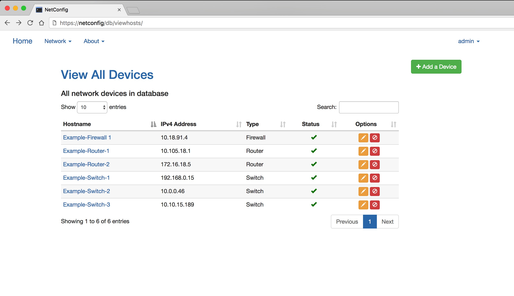

NetConfig
=========

.. image:: https://travis-ci.org/v1tal3/netconfig.svg?branch=master
    :target: https://travis-ci.org/v1tal3/netconfig

.. image:: https://travis-ci.org/v1tal3/netconfig.svg?branch=development
    :target: https://travis-ci.org/v1tal3/netconfig

.. image:: https://coveralls.io/repos/github/v1tal3/netconfig/badge.svg?branch=master
    :target: https://coveralls.io/github/v1tal3/netconfig?branch=master

What Is NetConfig?
------------------

NetConfig started out as a graphical overlay for my existing Python scripts, and I've been expanding it's features ever since.  It was originally built specifically for Cisco switches, routers, and firewalls, using IOS, IOS-XE, NX-OS, and ASA operating systems.  All device data is pulled in real-time via SSH and Netmiko.

NetConfig can retrieve a list of devices in one of two ways:

- Stored in a local SQLAlchemy database file
- Retrieved via API calls on an existing NetBox installation

In version 1.1, vendor neutral support was added using individual device files.

Features
--------

NetConfig was originally built as a graphical overlay for common CLI based interactions with non-API supported Cisco networking equipment.  At the core of the program is a need to access accurate, real-time information about any SSH enabled network device.  NetConfig accomplishes this by refreshing all page contents each time the page is refreshed, by pulling the information via SSH at the time of the page refresh.

NetConfig provides:

- Real-time information into your network devices
- Graphical overlay for existing Network devices without support for API's or other web-based interfaces

Installation
------------

Reference the Installation Guide section for instructions how on how to install NetConfig at readthedocs.io `install guide <http://netconfig.readthedocs.io/en/latest/install.html>`_
Install instructions were written for an Ubuntu 16.04 64-bit server.  NetConfig has not been tested with other OS's.

Upgrade
-------

Reference the Upgrading secion for instructions on upgrading the software at the readthedocs.io `upgrade guide <http://netconfig.readthedocs.io/en/latest/upgrade.html>`_.  See the `latest release <https://github.com/v1tal3/netconfig/releases>`_ page to download the most recent NetConfig version.

NetBox Integration
------------------

Reference the Netbox-Integration secion for instructions on pulling device inventory from an existing Netbox installation readthedocs.io `Netbox integration guide <http://netconfig.readthedocs.io/en/latest/readme.html#netbox-integration>`_.
Netbox can be found at their `GitHub repository <https://github.com/digitalocean/netbox>`_.

Screenshots
-----------

.. image:: img/example-switch.jpg

Important Caveats
-----------------

For all devices, Netconfig expects the hostname configured to match the actual hostname of the device (case-sensitive).  If not, some features may not work properly.

Contribute
----------

* Source Code: `NetConfig on GitHub <https://github.com/v1tal3/netconfig>`_
* Issue Tracker: `NetConfig Issue Tracker <https://github.com/v1tal3/netconfig/issues>`_
* Documentation: `NetConfig on ReadTheDocs <https://netconfig.readthedocs.io/en/latest/>`_
* Subreddit: `NetConfig on Reddit <https://www.reddit.com/r/netconfig/>`_

Support
-------

If you are having issues, please let us know
Please file an issue in the GitHub issue tracker

License
-------

NetConfig is licensed under the GPL v3.0 license.  A copy of the license is provided in the root NetConfig directory, or you can view it online `here <https://www.gnu.org/licenses/gpl-3.0.en.html>`_